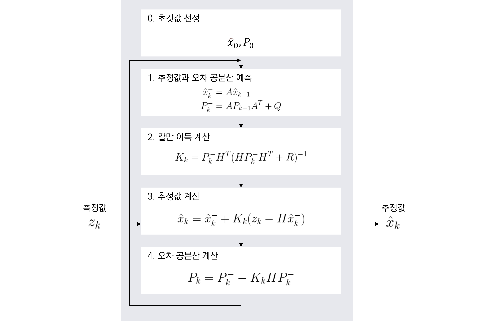

# Chapter4. 칼만 필터
## 4.1. 칼만 필터 알고리즘

**측정값($z_k$)가 입력되면** 칼만 필터 알고리즘에 의해 처리되어 **추정값($\hat{x}_k$)를 출력한다.** 

변수 목록을 정리하면 아래와 같다.

> 위첨자 $-$가 붙으면 '예측'값을 의미한다.

| 분류 | 변수 |
|:---:|:---:|
|외부 입력 |$z_k$ (측정값)|
|최종 출력 |$\hat{x}_k$ (추정값)|
|시스템 모델 변수|$A$, $H$, $Q$, $R$|
|내부적 계산 변수|$\hat{x}_k^-$ (예측값), $P_k^-$ (예측 오차 공분산), $P_k$ (오차 공분산), $K_k$(칼만 이득)|

## 4.2. 칼만 필터 알고리즘의 계산 과정
위 그림의 1단계('추정값과 오차 공분산 예측')에서는 추후 2단계('칼만 이득 계산')부터 4단계('오차 공분산 계산')까지 계속 사용할 사용할 변수 $\hat{x}_k^-$와 $P_k^-$를 계산한다.

2단계에서 칼만 이득($K_k$)를 계산한다.

3단계에서는 입력된 측정값($z_k$)으로 추정값($\hat{x}_k$)을 계산한다. 이 부분은 저주파 통과 필터와 관련이 있다.

4단계에서는 '추정값이 얼마나 정확한가'를 알려주는 척도인 '오차 공분산'을 계산한다. 이를 통해 앞서 계산한 추정값을 신뢰할지 아니면 폐기할지 결정한다.

$A$, $H$, $Q$, $R$은 필터 알고리즘이 수행되기 전 결정되는 값이다. (일종의 하이퍼파라미터) 해당 변수들을 어떻게 조정하는가에 따라 칼만 필터의 성능이 결정되고, 이 변수들로 만든 **시스템 모델이 실제 시스템과 유사할수록 성능이 좋아진다.**

위의 1~4 단계의 계산과정 구분을 의미론적으로 다시 나눠보면 '예측'과 '추정'으로 나눌 수 있다.

* <u>**예측 과정**</u>

계산과정의 1단계가 여기 속한다. 시스템 모델 변수 $A$와 $Q$를 사용해, 직전의 추정값($\hat{x}_{k-1}$)과 오차 공분산($P_{k-1}$)을 가지고 **다음 시각에 어떻게 변할지 그 예측값($\hat{x}_k^-$, $P_k^-$)을 만든다.**

* <u>**추정 과정**</u>

계산 과정의 2~4단계가 여기 속한다. 앞선 예측 과정에서의 예측값에 추가적으로 측정값($z_k$)을 전달받아, 시스템 모델 변수 $H$와 $R$을 사용해 **측정값과 예측값의 차이를 보정해 추정값($\hat{x}_{k}$)과 오차 공분산($P_{k}$)을 내놓는다.**

칼만 필터에서는 위 예측 과정과 추정 과정을 반복한다.